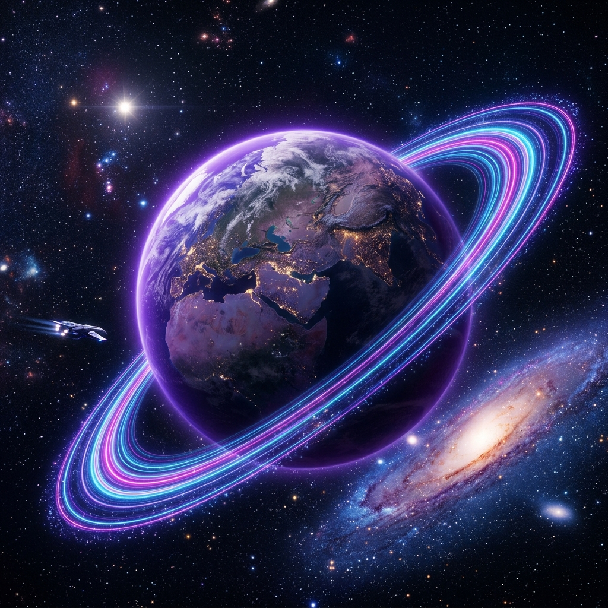

# 🌌 NEBULA EXPLORER: Interstellar Mission Log



> **"Exploring the unknown, one signal at a time."**

Nebula Explorer is a premium, full-stack Interstellar Discovery Dashboard. Built with a high-end Sci-Fi HUD aesthetic, it allows explorers to log planetary discoveries, monitor hazard levels, and visualize deep-space signals in real-time.

---

## 🛰️ MISSION FEATURES

- **🛸 Cinematic HUD**: A futuristic terminal interface with scanline animations, glitch effects, and Orbitron typography.
- **📡 Real-time Discovery Logging**: Integrated with MongoDB to store and retrieve planetary data on the fly.
- **⚠️ Hazard Indexing**: Dynamic visual gauges for planetary risk assessment (Radiation, Atmosphere, Gravity).
- **🚀 AI-Generated Assets**: Unique planetary visuals generated for an immersive deep-space experience.
- **💻 Responsive Mission Control**: Fully accessible across all terminal devices.

---

## 🛠️ TECH STACK

| Layer | Technology |
| :--- | :--- |
| **Frontend** | React, Tailwind CSS, Google Fonts (Orbitron/Michroma) |
| **Backend** | Node.js, Express.js |
| **Database** | MongoDB, Mongoose |
| **Assets** | AI-Generated Space Imagery |
| **Deployment** | Git / GitHub |

---

## ⚡ QUICK START

### 1. Initialize the Base
```bash
npm install
```

### 2. Connect to the Nebula
Ensure your local MongoDB instance is active.

### 3. Seed the Logs
```bash
node nebula_seed.js
```

### 4. Launch Mission Control
```bash
node nebula_server.js
```

Open your terminal at `http://localhost:5000/nebula_explorer.html` to begin the mission.

---

## 📂 DIRECTORY STRUCTURE

- `nebula_explorer.html`: The interactive HUD dashboard.
- `nebula_server.js`: Express backend & static asset server.
- `nebula_schema.js`: Discovery data structure.
- `nebula_seed.js`: Initial planetary logs.
- `exoplanet.png`: Primary sector asset.

---

## 🔒 SECURITY PROTOCOLS
This project was developed for educational and experimental purposes. Secure link active.

